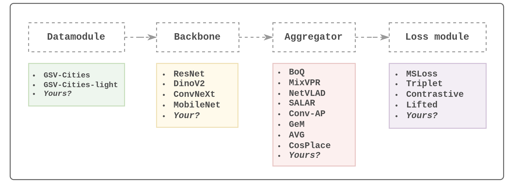

# OpenVPRLab

**OpenVPRLab** is a comprehensive open-source framework for Visual Place Recognition (VPR). Designed to facilitate the training and iterative development of deep models for VPR, it simplifies the process for researchers and developers to achieve replicable state-of-the-art performance.

Visual Place Recognition (VPR) is a crucial task in robotics and computer vision, enabling systems to recognize and identify locations based on visual input. OpenVPRLab provides the tools and infrastructure to push the boundaries of VPR research and application.

## Use Cases

* **Research and Development:** Develop and test new Visual Place Recognition techniques with ease.
* **Training and Fine-tuning:** Test, train, or fine-tune existing state-of-the-art (SOTA) methods.
* **Education:** Educate and teach newcomers in the field of Visual Place Recognition, providing a hands-on learning experience. (your Visual Place Recognition journey starts here)

## Features



* **Easy Dataset Management**
  * Download datasets like `GSV-Cities` and `GSV-Cities-light` with a single command to start your experiments immediately.
  * Pre-configured validation datasets for effortless monitoring.
* **Highly Modular Design**
  * Simple and effective training architecture: `[Data] -> [Backbone] -> [Aggregation] -> [Loss]`
  * Implement and integrate your own aggregator, backbone, loss function or other components seamlessly.
  * Focus on specific aspects of VPR without worrying about other components, ensuring a smooth development experience.
* **Extensive Loss Functions**
  * Leverage dozens of loss functions from the deep metric learning community through the integrated `deep_metric_learning` library, enabling advanced model optimization and experimentation.
* Track your experiments with integrated Tensorboard support
* Visualize your model performance (recall plots, preview hard retrievals, missed retrievals, attention maps, ...etc)

## Installation

Follows these steps to install OpenVPRLab

```bash
# Clone the repository
git clone https://github.com/amaralibey/OpenVPRLab.git

# Navigate to the project directory
cd OpenVPRLab

# Install the required dependencies
pip install -r requirements.txt
```

## Getting Started

Here’s a quickstart guide to help you get up and running with OpenVPRLab:

#### 1. Download the datasets:

OpenVPRLab comes with **4 datasets** out of the box. Two for training (`gsv-cities` and `gsv-cities-light`), and two validation datasets (`msls-val` and `pitts30k-val`). For first use, you can download the datasets using the provided python script, the downloaded datasets will be unzipped into the folder is `data/` by default, so make sure you have enough space`:

```bash
python scripts/datasets_downloader.py
```

#### 2. Train a Model:

The best way to choose hyperparameters is by using a
