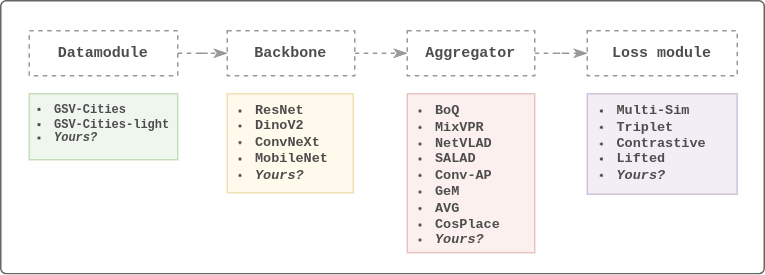

# OpenVPRLab

**OpenVPRLab** is a comprehensive open-source framework for Visual Place Recognition (VPR). Designed to facilitate the training and iterative development of deep models for VPR, it simplifies the process for researchers and developers to achieve replicable state-of-the-art performance.

Visual Place Recognition (VPR) is a crucial task in robotics and computer vision, enabling systems to recognize and identify locations based on visual input. OpenVPRLab provides the tools and infrastructure to push the boundaries of VPR research and application.

## Use Cases

* **Research and Development:** Develop and test new Visual Place Recognition techniques with ease.
* **Training and Fine-tuning:** Test, train, or fine-tune existing state-of-the-art (SOTA) methods.
* **Education:** Educate and teach newcomers in the field of Visual Place Recognition, providing a hands-on learning experience. (your Visual Place Recognition journey starts here)

## Features



* **Easy Dataset Management**
  * Download datasets like `GSV-Cities` and `GSV-Cities-light` with a single command to start your experiments immediately.
  * Pre-configured validation datasets for effortless monitoring.
* **Highly Modular Design**
  * Simple and effective training architecture: `[Data] -> [Backbone] -> [Aggregation] -> [Loss]`
  * Implement and integrate your own aggregator, backbone, loss function or other components seamlessly.
  * Focus on specific aspects of VPR without worrying about other components, ensuring a smooth development experience.
* **Extensive Loss Functions**
  * Leverage dozens of loss functions from the deep metric learning community through the integrated `deep_metric_learning` library, enabling advanced model optimization and experimentation.
* Track your experiments with integrated Tensorboard support
* Visualize your model performance (recall plots, preview hard retrievals, missed retrievals, attention maps, ...etc)

## Installation

Follows these steps to install OpenVPRLab

```bash
# Clone the repository
git clone https://github.com/amaralibey/OpenVPRLab.git

# Navigate to the project directory
cd OpenVPRLab

# Create environment and install the required dependencies
conda env create -f environment.yml

# activate the openvpr environment
conda activate openvpr
```

## Getting Started

Here’s a quickstart guide to help you get up and running with OpenVPRLab:

#### 1. Download the datasets:

OpenVPRLab comes with **4 datasets** out of the box: two for training (`gsv-cities` and `gsv-cities-light`), and two validation datasets (`msls-val` and `pitts30k-val`). For the first use, you can download the datasets using the provided Python script. The downloaded datasets will be unzipped into the `data/` folder by default, so make sure you have enough space:

```bash
python scripts/datasets_downloader.py
```

#### 2. Try the Framework:

To quickly test if the framework is all set up. Run the following command (NOTE: you need at least `gsv-cities-light` and `msls-val` datasets to be downloaded in order for the training to run.)

```bash
python run.py --dev
```

This will run one train iteration of ResNet50-MixVPR (on `gsv-cities-light`) and one validation iteration (on `msls-val`). You should see the data and model summaries on the console.

### 3. Train a Model

The best way to train a model in OpenVPRLab is by first creating a config file for all the hyperparameters. This reduces clutter from the command line. We include sample config files; take a look at `config/sample_model_config.yaml`. You can train a MixVPR model with a ResNet50 backbone by running the following command:

```bash
python run.py --config ./config/resnet50_mixvpr.yaml
```

You can also control hyperparameters directly from the command line. These command-line arguments will override those in the config file. For example:

```bash
python run.py --config ./config/resnet50_mixvpr.yaml --batch_size 40 --lr 0.0001
```

The hyperparameters used to train the network will be saved into the `logs` folder for every training experiment under the name `hparam.yaml` (example: `logs/resnet50/MixVPR/version_6/hparams.yaml`). This helps you track, remember, and reproduce your experiments effectively.

### 4. Monitor Training with Tensorboard:

```bash
tensorboard --logdir ./logs/
```

---

# Tutorial: How to Develop Your Own VPR Aggregator

One of the primary goals of OpenVPRLab is to make it easy and straightforward to work on individual components of VPR. Here’s how you can develop a new aggregation technique and train it using the framework.

#### 1. Create Your Aggregator

Start by creating a new Python file for your aggregator (e.g. `my_agg.py`), and place it under `src/models/aggregators/my_agg.py`.

**Example code for your aggregator:**

```python
import torch

class ConvAP(torch.nn.Module):
    def __init__(self, in_channels=1024, out_channels=512, s1=2, s2=2):
        super().__init__()
        self.channel_pool = torch.nn.Conv2d(in_channels=in_channels, out_channels=out_channels, kernel_size=1)
        self.AAP = torch.nn.AdaptiveAvgPool2d((s1, s2))

    def forward(self, x):
        x = self.channel_pool(x)
        x = self.AAP(x)
        x = torch.nn.functional.normalize(x.flatten(1), p=2, dim=1)
        return x
```

#### 2. Integrate your aggregator into the `__init__.py` file

Import your new aggregator into `src/models/aggregators/__init__.py` to make it part of the package. This allows it to be easily referenced in your configuration.

```python
from .mixvpr import MixVPR
from .boq import BoQ
from .my_agg import ConvAP  # <==== add your here
```

#### 3. Run a Training Experiment

You can start training with the default settings by running the following command:

```bash
python run.py --backbone ResNet --aggregator ConvAP --batch_size 60 --lr 0.0001
```

NOTE: in order to arguments of your aggregator and backbone (and more), it's better to use a config file.

#### 4. Create a Configuration File

For more control over your experiment, create a YAML configuration file (e.g., `my_model_config.yaml`) in the `config/` directory:

```yaml
datamodule:
  train_set_name: "gsv-cities-light" # use "gsv-cities" if you have downloaded the full dataset
  train_image_size: 
    - 224
    - 224
  img_per_place: 4
  batch_size: 100
  num_workers: 8
  val_set_names:
    - "msls-val"
    - "pitts30k-val"

backbone:
  module: src.models.backbones
  class: ResNet
  params:
    backbone_name: "resnet18"
    pretrained: true
    num_unfrozen_blocks: 1
    crop_last_block: true

aggregator:
  module: src.models.aggregators # module path
  class: ConvAP    # class name in the __init__.py file in the aggregators directory
  params:
    in_channels:  # if left blank we will use backbone.out_channels.
    out_channels: 256
    s1: 3
    s2: 3

trainer:
  optimizer: adamw
  lr: 0.0001      # learning rate
  wd: 0.001       # weight decay
  warmup: 2000    # linear warmup steps
  max_epochs: 30
  milestones:
    - 10
    - 20
  lr_mult: 0.1 # learning rate multiplier at each milestone

# the rest of the hyperparameters are the defaults one, they can be found in `argparser.py`
```

#### 5. Train Using the Configuration File

Run the training with your custom configuration:

```bash
python run.py --config ./config/my_model_config.yaml
```

For more detailed configurations, refer to `config/sample_model_config.yaml`.

#### 6. Monitor Your Experiment

Model weights will be saved in `logs/resnet18/ConvAP/version_X`, where X represents the version. ALL hyperparameters used for the experiment will be saved in `logs/resnet18/ConvAP/version_X/hparams.yaml`.

Tensorboard loggings will also be saved into the directory. Run the following command to start visualizing experiments:

```bash
tensorboard --logdir ./logs/resnet18/ConvAP
```

## More features, tutorials and methods to come soon...
